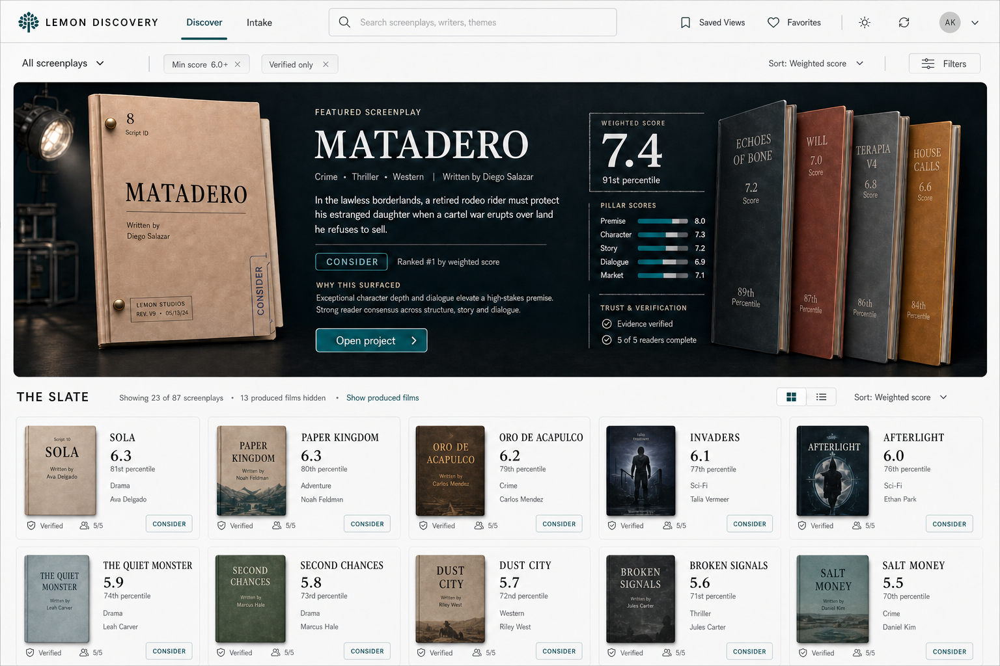

# Discovery Cleaned Hybrid

Approved local design direction for Lemon Discovery.

## Review URLs

- Cleaned hybrid review: `/discover?ui=hybrid`
- Current production-style fallback: `/discover?ui=classic`
- Cleaned hybrid with drawer fallback: `/discover?ui=hybrid&preview=drawer`

The current presentation remains the default until the signed-in hybrid review is approved. The classic query remains available as the guaranteed fallback after promotion.

## Design Contract

- Cool porcelain application chrome, not brown or parchment-colored GUI.
- Cinematic charcoal feature stage reserved for the strongest screenplay.
- Warm physical screenplay covers create the tactile layer.
- Petrol teal is the primary action color; verdict colors remain semantic.
- Stable 64-pixel desktop header. Its only scroll response is a subtle border and shadow.
- One clear primary action on the feature: `Open project`.
- Featured screenplay, next four ranked folders, Film Now rail, and continuous 50-item slate grid use real filtered and sorted data.
- Loading, error, no-data, no-results, review-only, light, dark, desktop, and tablet states remain intentional.
- Existing search, filters, sort, saved views, favorites, selection, share state, producer calibration, project workspace, and drawer fallback remain the source of behavior.
- Motion must explain hierarchy and state. Reduced-motion users receive no decorative movement.

## Approved Reference

